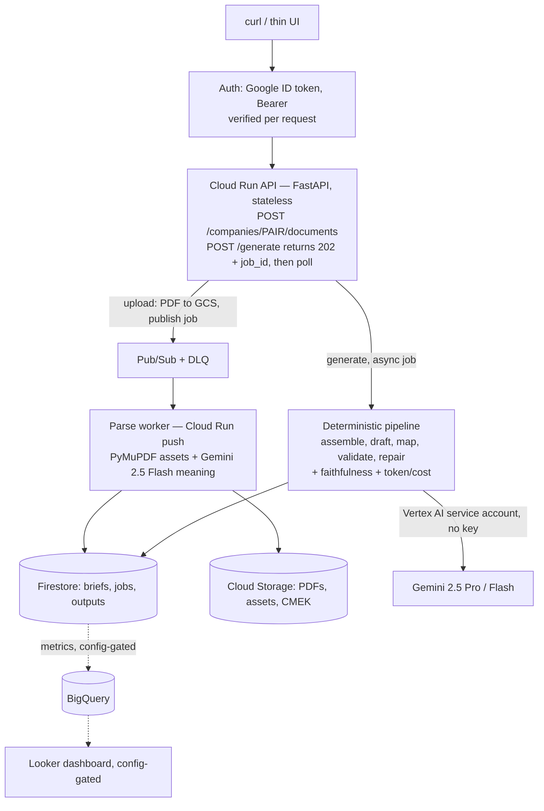

# Generative Collateral Platform — Architecture

**The product is two authenticated API endpoints** — upload context PDFs; generate a
tailored, layout-valid article as structured JSON. The upload UI is an optional thin
client; the demo is from the terminal. Runs on **Google Cloud Run** with **Vertex AI**
for the model. **Single-tenant** prototype with a clean seam to multi-tenant.

---

## Diagram



Cross-cutting — **in place:** per-tenant-ready **CMEK** on the bucket · **least-privilege IAM** (the
Cloud Run SA holds only `datastore.user` + `aiplatform.user` + bucket `objectAdmin` + `pubsub.publisher`) ·
**EU-region storage** (GCS + Firestore in `europe-west1`; model calls use the `global` Vertex endpoint —
EU model residency is on the roadmap). **Hardening posture (not yet provisioned):** Model Armor · VPC-SC ·
Secret Manager.

---

## Request flows
1. **Upload** `POST /companies/{pair}/documents` (auth) → PDF to GCS → **publish to Pub/Sub**
   (or in-process locally) → parse worker: **PyMuPDF** (image/logo asset bytes) +
   **Gemini 2.5 Flash** (multimodal meaning) → typed `CompanyBrief` in Firestore. **Document AI**
   (layout/tables/OCR, +HITL on low-confidence) is the managed at-scale swap.
   Idempotent on `(role, filename)`; retries + dead-letter queue. Returns a `job_id`.
2. **Generate** `POST /generate {pair_id, prompt, template_id}` (auth) → **202 + `job_id`**,
   runs off the request path → grounded, cited draft → mapped to template → constraints
   validated **in code** → repair loop → `ArticleJSON` (+ citations, confidence, **token/cost**).
   Poll `GET /generate/{pair}/{job_id}`. An `Idempotency-Key` header de-dupes retries.

*(No publish/approval step — the API returns a reviewable draft; the human review happens
where the JSON is consumed. A formal approval gate enters only if we add a publish action.)*

---

## Authentication vs authorization

Every data route is guarded by **two distinct checks**, and a single Google **ID token** (a
Google-signed OIDC JWT carrying `email`, `aud`, `exp`) satisfies both:

- **Authentication — *who are you?*** In-app, `require_identity` verifies the ID token against
  Google's public certs (signature, expiry, and `aud` = the service URL) and takes the `email`
  claim as the principal. Missing/invalid → **401**. Declared as an OpenAPI `HTTPBearer` scheme,
  so the requirement shows on every protected route.
- **Authorization — *allowed to do this?*** Cloud Run IAM checks the caller's token grants
  `roles/run.invoker` on the service, at the platform edge. No grant → **403**, before the app runs.

On the wire: `Authorization: Bearer <id-token>` → the **edge** runs the IAM authorization check →
the **app** authenticates and resolves the principal. Defense in depth: one token, two independent
gates (platform + application).

**Fine-grained (per-tenant) authorization** is the next step: bind `tenant_id` to a verified token
claim instead of the `X-Tenant-ID` header, so a principal can reach only its own tenant's documents.
Storage is already tenant-keyed, so it's an auth-claim change, not a refactor.

---

## Security & responsible AI

Mapped to ML6's **Safe & Secure / Responsible AI** pillars — implemented vs the production-hardening posture.

**Implemented**
- **Prompt-injection defense** (untrusted PDFs). Document text is a separate **DATA channel**, never
  concatenated into the instruction block; the system prompt forbids obeying instructions inside it
  (`INJECTION_GUARD`); the writer sees only **distilled facts**, not raw PDF text.
- **Grounded, cited, no fabrication.** The writer uses only source-tagged brief facts, tags each block
  with the fact-ids it used, and **abstains** rather than inventing; a claim-level faithfulness check
  flags unsupported/dangling citations. **Logos/images are extracted bytes** (PyMuPDF), never generated —
  so no fabricated brand assets.
- **Graceful failure.** The repair loop is capped; a still-over-limit block degrades to sentence-boundary
  truncation and is flagged (`truncated_blocks`) — never a broken doc or an infinite loop.
- **Least-privilege + no secrets.** Cloud Run runs as a scoped service account (no API key — Vertex via
  ADC; the SA holds only `datastore.user`, `aiplatform.user`, bucket `objectAdmin`, `pubsub.publisher`).
  Secrets stay out of git (`.env` git-ignored, `.env.example` only).
- **Encryption · residency · retention.** GCS is **CMEK**-encrypted; storage (GCS + Firestore) is in
  **EU `europe-west1`**; a bucket lifecycle rule deletes objects after 365 days; `DELETE /assets/{…}` and
  `DELETE /templates/{…}` give explicit removal.
- **Reproducibility + cost.** Every output stamps the prompt / template / model version and token + USD cost.

**Production-hardening posture (decided, not yet provisioned)**
- **Model Armor** on Vertex (content-safety / jailbreak + prompt-injection filtering in front of the model).
- **VPC-SC** perimeter around the data services; **Secret Manager** (if a key path is ever introduced).
- **DLP / PII detection** on uploads (today PII is handled by residency + retention + least-privilege, not
  scanning); **EU model residency** (calls currently use the `global` Vertex endpoint); per-tenant
  **rate / cost budgets**.

*(No human-approval gate: the API emits a **reviewable draft** and never publishes, so review lives where
the JSON is consumed — a formal gate would only enter with a publish/send action.)*

---

## Components

| Plane | GCP service | Role |
|---|---|---|
| Auth | **Google ID token** (verified in-app) + Cloud Run IAM | every data route requires `Authorization: Bearer <id-token>` |
| API | **Cloud Run** (FastAPI) | the endpoints; stateless; scale-to-zero |
| Async parse | **Pub/Sub** + **Cloud Run** push worker | decoupled, idempotent, retried + DLQ |
| Parsing | **PyMuPDF** + **Gemini 2.5 Flash** (Document AI = managed scale swap) | multimodal meaning + images classified by shape (logo/photo/chart) |
| Generation | deterministic pipeline on Cloud Run | assemble → draft → map → validate → repair |
| Templates | built-in (code) + **custom CRUD via `/templates`** (POST/PUT/DELETE, Firestore, tenant-scoped) | the hard layout contract |
| Images | **role-based selection** (logo/photo/chart slots) | best extracted image per slot — sender-first, no reuse, empty if none |
| Model | **Vertex AI** — Gemini 2.5 Pro / Flash | via the Cloud Run service account (no API key) |
| Retrieval | long-context + (prod) context caching; structured facts in Firestore | bounded 2-company corpus |
| Storage | **Cloud Storage** (CMEK) · **Firestore** | PDFs/assets · briefs/jobs/outputs |
| Cost | per-generation token + USD on `meta` | per-model pricing |
| Cache | **Memorystore (Redis)** — fail-open, config-gated | a cache hit skips the model call |
| Metrics | **BigQuery** row per generation → Looker Studio (config-gated) | confidence/faithfulness/cost per tenant |
| Eval | golden-set harness (offline + `--live`) | faithfulness/constraint regression gate |
| Governance | **CMEK + least-priv IAM** (in place); Model Armor · VPC-SC · Secret Manager (hardening posture) | security + responsible AI |
| CI/CD | **Cloud Build** + **Terraform** (`infra/`) | full stack as code, EU |

---

## API spec (the contract)

| Method · path | Auth | Body / params | Returns |
|---|---|---|---|
| `POST /companies/{pair}/documents` | Bearer | multipart: `role`, `files[]` (PDF) | `202` `{job_id}` |
| `GET  /jobs/{pair}` · `GET /jobs/{pair}/{job}` | Bearer | list: `?type` `?status` `?limit` | jobs for a pair (parse + generate), newest-first · one job |
| `POST /generate` | Bearer | `{pair_id, prompt, template_id}` · `Idempotency-Key?` | `202` `{job_id, poll}` |
| `GET  /generate/{pair}/{job}` | Bearer | — | `{status, result: ArticleJSON}` |
| `GET  /companies/{pair}` · `GET /templates` · `GET /assets/{pair}/{id}` | Bearer | — | briefs · templates · image |
| `POST /templates` | Bearer | `TemplateModel` (id, name, blocks[], palette[]) | `201` validated template (tenant-scoped) |
| `PUT /templates/{id}` · `DELETE /templates/{id}` | Bearer | `TemplateModel` (PUT) | edit / delete a custom template (built-ins read-only) |
| `DELETE /assets/{pair}/{id}` | Bearer | — | delete an extracted asset |
| `GET  /health` · `/healthz` · `GET /` | public | — | liveness · UI |
| `POST /internal/parse` | OIDC (Pub/Sub push SA) | base64 push envelope | the async parse worker; not a public route |

Full machine-readable spec is the app's auto-generated **OpenAPI** at `/openapi.json` (interactive
Swagger UI at `/docs`), where the `HTTPBearer` security scheme is attached to every protected route.

**Spec artifacts in the repo:** a committed snapshot lives in **`openapi.json`**, and
**`postman_collection.json`** imports straight into Postman — base URL preset, Bearer auth wired
(for `AUTH_MODE=google`), and a test script that auto-captures `job_id` so the poll request just runs.
Postman can also import `openapi.json` (or the live `/openapi.json`) to generate a collection directly.

---

## Data model & storage layout

Everything is keyed **tenant-first**, so isolation is structural (one tenant's key can never address
another's). A **pair** groups one `sender` + one `receiver`; reusing a `pair_id` is the intended pattern
(upload once, generate many) and is last-write-wins per role.

**Firestore** (documents) — database `(default)`, Native mode, `europe-west1`:
```
tenants/{tenant}/pairs/{pair}/briefs/{sender|receiver}   CompanyBrief (source-tagged facts)
tenants/{tenant}/pairs/{pair}/jobs/{job_id}              {status, message, kind, created_at, updated_at}
tenants/{tenant}/pairs/{pair}/outputs/{request_id}       ArticleJSON  (request_id == its job_id)
tenants/{tenant}/templates/{id}                          custom TemplateModel
```
**Cloud Storage** (blobs) — bucket `…-collateral`, CMEK:
```
{tenant}/{pair}/uploads/{role}_{filename}                raw PDFs (idempotent per role+filename)
{tenant}/{pair}/assets/{asset_id}.{ext}                  extracted images / logos
```
A **job** carries `kind` (`parse` | `generate`) — set on create, preserved across status updates — plus
`created_at` / `updated_at`, so `GET /jobs/{pair}` returns a newest-first, filterable history. A finished
generate job links straight to its `ArticleJSON` because the output reuses the job id.

---

## Limits & failure modes

- **Status codes:** `401` missing/invalid token · `403` IAM (no `run.invoker`) · `404` unknown id ·
  `409` briefs not ready / id conflict (built-in or duplicate) · `413` upload over `MAX_UPLOAD_MB`
  (default 10 MB) · `422` invalid body (Pydantic + template validation) · `503` model not configured.
- **Idempotency:** an `Idempotency-Key` header on `/generate` makes a retried POST return the same job;
  uploads are idempotent per `(role, filename)`.
- **Fail-open add-ons:** the result cache and the metrics export never break a request — a Redis/BigQuery
  outage degrades to "no cache" / "no row", not a `5xx`.
- **Scaling:** Cloud Run scales **0 → 10** instances; the heavy work (parse, generate) runs **off the
  request path** (Pub/Sub worker + the async job), so request latency is bounded and bursts queue.

---

## Locked decisions
- **Runtime = Cloud Run.** The pipeline is deterministic, stateless, tool-less → Cloud Run is
  the right host. **Agent Engine / ADK** is the documented upgrade *when we add tools, multi-step
  reasoning, memory, or a HITL pause* — it buys nothing today and costs more.
- **Auth = app-level Google ID-token verification** (`AUTH_MODE=google`), declared as an OpenAPI
  `HTTPBearer` scheme, paired with Cloud Run `--no-allow-unauthenticated` (defense in depth).
- **Retrieval = long-context + context caching**, not RAG; structured facts in Firestore;
  Vertex AI Search is the scale path. No separate vector DB.
- **Factual correctness** = generate-from-briefs + citations + per-claim faithfulness check.
- **Layout** = hard limits enforced **in code** (+ render-and-measure as the production truth).
- **Tenancy = single-tenant prototype** (`tenant` defaults to `default`); the store/routes are
  already tenant-keyed, so multi-tenant is a config + auth-claim change, not a refactor.
- **Models:** Gemini **2.5 Pro** (writer), **2.5 Flash** (parse / verify / repair).

---

## Model configuration

The model is **not** a Google Cloud setting — it's a set of **env vars** the app passes to Vertex AI
(`GOOGLE_GENAI_USE_VERTEXAI=true`, so calls use the Cloud Run service account's ADC — no API key).
Each role is independently swappable:

| Env var | Role | Default |
|---|---|---|
| `MODEL_WRITER` | article writer (quality) | `gemini-2.5-pro` |
| `MODEL_PARSER` | multimodal PDF → brief | `gemini-2.5-flash` |
| `MODEL_CHEAP` | verify / repair | `gemini-2.5-flash` |

**Precedence (last wins):** code defaults in `app/config.py` → Terraform (`model_writer` / `model_flash`
→ env) → the **live Cloud Run env vars** — the source of truth for the deployed service.

**To change one:** set the env var — `gcloud run services update collateral-api --region=<r>
--update-env-vars MODEL_WRITER=<id>` (or the console's *Variables & Secrets*), or change it in Terraform
and `apply`. The id must be a model **available to the project at `GOOGLE_CLOUD_LOCATION`** (set to
`global`, since `europe-west1` serves no Gemini for this project — *storage* still stays in-region);
today that's `gemini-2.5-pro` / `gemini-2.5-flash`. An unavailable id fails with a clear `4xx`, never
silently. The writer model is stamped on every output (`meta.model_writer`) for reproducibility.

---

## Roadmap (what's deliberately deferred)
- **Multi-tenancy:** derive `tenant_id` from the verified token claim (not a header); per-tenant
  CMEK + Firestore partition + rate/cost budgets. *(Plumbing already in place.)*
- **Org dashboard:** the per-generation **BigQuery metrics export is built (config-gated)** —
  `enable_metrics=true` streams a row per generation; what remains is pointing **Looker Studio** at the
  table with per-tenant row filters.
- **Agentic features → Agent Engine:** tools (live research, image sourcing), multi-step, HITL.
- **Render-and-measure** layout validation; the **golden-set eval harness is built**
  (`app.eval.harness`, offline + `--live`) — next is online auto-raters + a larger labelled set.

---

## Core vs additions
- **Core (the deliverable):** the two `curl`-able, authenticated endpoints.
- **Additions:** the upload UI and the org dashboard — thin clients over the API; not required.
