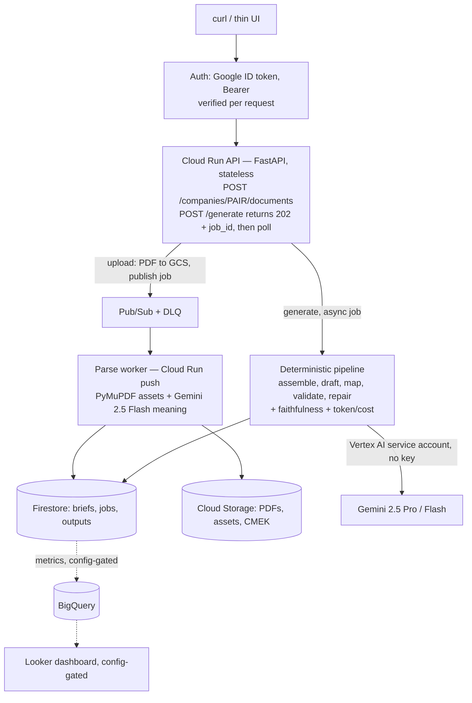

# Generative Collateral Platform — Architecture

**The product is two authenticated API endpoints** — upload context PDFs; generate a
tailored, layout-valid article as structured JSON. The upload UI is an optional thin
client; the demo is from the terminal. Runs on **Google Cloud Run** with **Vertex AI**
for the model. **Single-tenant** prototype with a clean seam to multi-tenant.

---

## Diagram

Cross-cutting: **Model Armor** · per-tenant-ready **CMEK** · **EU residency** · **VPC-SC** ·
**Secret Manager** · least-privilege **IAM** (the Cloud Run SA has `roles/aiplatform.user`).

---

## Request flows
1. **Upload** `POST /companies/{pair}/documents` (auth) → PDF to GCS → **publish to Pub/Sub**
   (or in-process locally) → parse worker: **PyMuPDF** (image/logo asset bytes) +
   **Gemini 2.5 Flash** (multimodal meaning) → typed `CompanyBrief` in Firestore. **Document AI**
   (layout/tables/OCR, +HITL on low-confidence) is the managed at-scale swap.
   Idempotent on `(role, filename)`; retries + dead-letter queue. Returns a `job_id`.
2. **Generate** `POST /generate {pair_id, prompt, template_id}` (auth) → **202 + `job_id`**,
   runs off the request path → grounded, cited draft → mapped to template → constraints
   validated **in code** → repair loop → `ArticleJSON` (+ citations, confidence, **token/cost**).
   Poll `GET /generate/{pair}/{job_id}`. An `Idempotency-Key` header de-dupes retries.

*(No publish/approval step — the API returns a reviewable draft; the human review happens
where the JSON is consumed. A formal approval gate enters only if we add a publish action.)*

---

## Components

| Plane | GCP service | Role |
|---|---|---|
| Auth | **Google ID token** (verified in-app) + Cloud Run IAM | every data route requires `Authorization: Bearer <id-token>` |
| API | **Cloud Run** (FastAPI) | the endpoints; stateless; scale-to-zero |
| Async parse | **Pub/Sub** + **Cloud Run** push worker | decoupled, idempotent, retried + DLQ |
| Parsing | **PyMuPDF** + **Gemini 2.5 Flash** (Document AI = managed scale swap) | image/logo assets + multimodal meaning |
| Generation | deterministic pipeline on Cloud Run | assemble → draft → map → validate → repair |
| Templates | built-in (code) + **custom via `POST /templates`** (Firestore, tenant-scoped) | the hard layout contract |
| Model | **Vertex AI** — Gemini 2.5 Pro / Flash | via the Cloud Run service account (no API key) |
| Retrieval | long-context + (prod) context caching; structured facts in Firestore | bounded 2-company corpus |
| Storage | **Cloud Storage** (CMEK) · **Firestore** | PDFs/assets · briefs/jobs/outputs |
| Cost | per-generation token + USD on `meta` | per-model pricing |
| Cache | **Memorystore (Redis)** — fail-open, config-gated | a cache hit skips the model call |
| Metrics | **BigQuery** row per generation → Looker Studio (config-gated) | confidence/faithfulness/cost per tenant |
| Eval | golden-set harness (offline + `--live`) | faithfulness/constraint regression gate |
| Governance | Model Armor · CMEK · VPC-SC · Secret Manager · IAM | security + responsible AI |
| CI/CD | **Cloud Build** + **Terraform** (`infra/`) | full stack as code, EU |

---

## API spec (the contract)

| Method · path | Auth | Body / params | Returns |
|---|---|---|---|
| `POST /companies/{pair}/documents` | Bearer | multipart: `role`, `files[]` (PDF) | `202` `{job_id}` |
| `GET  /jobs/{pair}/{job}` | Bearer | — | parse job status |
| `POST /generate` | Bearer | `{pair_id, prompt, template_id}` · `Idempotency-Key?` | `202` `{job_id, poll}` |
| `GET  /generate/{pair}/{job}` | Bearer | — | `{status, result: ArticleJSON}` |
| `GET  /companies/{pair}` · `GET /templates` · `GET /assets/{pair}/{id}` | Bearer | — | briefs · templates · image |
| `POST /templates` | Bearer | `TemplateModel` (id, name, blocks[], palette[]) | `201` validated template (tenant-scoped) |
| `GET  /health` · `/healthz` · `GET /` | public | — | liveness · UI |

Full machine-readable spec is the app's auto-generated **OpenAPI** at `/openapi.json` (interactive
Swagger UI at `/docs`), where the `HTTPBearer` security scheme is attached to every protected route.

**Spec artifacts in the repo:** a committed snapshot lives in **`openapi.json`**, and
**`postman_collection.json`** imports straight into Postman — base URL preset, Bearer auth wired
(for `AUTH_MODE=google`), and a test script that auto-captures `job_id` so the poll request just runs.
Postman can also import `openapi.json` (or the live `/openapi.json`) to generate a collection directly.

---

## Locked decisions
- **Runtime = Cloud Run.** The pipeline is deterministic, stateless, tool-less → Cloud Run is
  the right host. **Agent Engine / ADK** is the documented upgrade *when we add tools, multi-step
  reasoning, memory, or a HITL pause* — it buys nothing today and costs more.
- **Auth = app-level Google ID-token verification** (`AUTH_MODE=google`), declared as an OpenAPI
  `HTTPBearer` scheme, paired with Cloud Run `--no-allow-unauthenticated` (defense in depth).
- **Retrieval = long-context + context caching**, not RAG; structured facts in Firestore;
  Vertex AI Search is the scale path. No separate vector DB.
- **Factual correctness** = generate-from-briefs + citations + per-claim faithfulness check.
- **Layout** = hard limits enforced **in code** (+ render-and-measure as the production truth).
- **Tenancy = single-tenant prototype** (`tenant` defaults to `default`); the store/routes are
  already tenant-keyed, so multi-tenant is a config + auth-claim change, not a refactor.
- **Models:** Gemini **2.5 Pro** (writer), **2.5 Flash** (parse / verify / repair).

---

## Roadmap (what's deliberately deferred)
- **Multi-tenancy:** derive `tenant_id` from the verified token claim (not a header); per-tenant
  CMEK + Firestore partition + rate/cost budgets. *(Plumbing already in place.)*
- **Org dashboard:** the per-generation **BigQuery metrics export is built (config-gated)** —
  `enable_metrics=true` streams a row per generation; what remains is pointing **Looker Studio** at the
  table with per-tenant row filters.
- **Agentic features → Agent Engine:** tools (live research, image sourcing), multi-step, HITL.
- **Render-and-measure** layout validation; the **golden-set eval harness is built**
  (`app.eval.harness`, offline + `--live`) — next is online auto-raters + a larger labelled set.

---

## Core vs additions
- **Core (the deliverable):** the two `curl`-able, authenticated endpoints.
- **Additions:** the upload UI and the org dashboard — thin clients over the API; not required.
